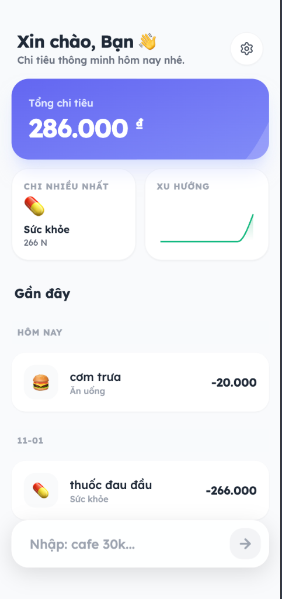
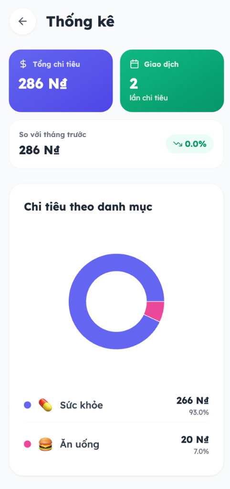

# NhanhChiTieu (FastExpense) - PWA Expense Tracker 💸⚡

<div align="center">

[](https://fast-expense.vercel.app/)
[](https://nextjs.org/)
[](https://fast-expense.vercel.app/)

**[🚀 Try Live Demo →](https://fast-expense.vercel.app/)**

</div>

---

A **lightning-fast**, **offline-first** expense tracker using **intelligent parsing** and **fuzzy matching** to understand Vietnamese natural language inputs (e.g., "cafe 30k", "ăn trưa 50 nghìn") instantly.

## 📱 Screenshots

<div align="center">
  
  
  
</div>

## ✨ Features

- ⚡ **Instant Parsing**: Type natural language → Auto-detect amount & category
- 🇻🇳 **Vietnamese Language**: Understands slang (k, nghìn, triệu, lít, củ)
- 📱 **PWA Ready**: Install as mobile/desktop app, works offline
- 💾 **Offline-First**: All data stored locally in browser
- 🎨 **Beautiful UI**: Modern design with Lexend font & smooth animations
- 📊 **Smart Statistics**: Pie charts, line charts, and spending insights
- 🏷️ **11 Categories**: Auto-categorization using fuzzy matching (Fuse.js)
- 💨 **Blazing Fast**: Built with Next.js 15 + Turbopack
- 🔒 **100% Private**: No tracking, no server, 100% local storage

## 🚀 Quick Start

### Prerequisites
- Node.js 18+ 
- npm or yarn

### Installation

1. **Clone the repository:**
   ```bash
   git clone https://github.com/DinhKhai0201/fast-expense.git
   cd fast-expense
   ```

2. **Install dependencies:**
   ```bash
   npm install
   ```

3. **Run development server:**
   ```bash
   npm run dev
   ```

4. **Open browser:**
   Navigate to [http://localhost:3000](http://localhost:3000)

### Production Build

```bash
npm run build
npm start
```

## � How It Works

### 🧠 Smart Parsing Engine

The app uses a **custom Vietnamese NLP parser** with **Fuse.js** for fuzzy matching:

1. **Amount Detection**: Regex captures numbers with Vietnamese units
   - Supports: `k`, `nghìn`, `tr`, `triệu`, `m`, `lít`, `củ`
   - Examples: "30k" → 30,000 | "1.5tr" → 1,500,000

2. **Category Matching**: Fuzzy search across 100+ keywords
   - 11 categories: Food, Transport, Shopping, Bills, Beauty, Health, Education, Social, Entertainment, Investment, Income
   - Smart fallback: Fuse.js (threshold 0.4) → Exact match → "Other"

3. **Live Preview**: Instant visual feedback as you type

### 📊 Key Technologies

- **Framework**: Next.js 15 (App Router + Turbopack)
- **UI**: React 18 + Tailwind CSS
- **Charts**: Recharts (Pie, Line, Bar charts)
- **Parsing**: Fuse.js (fuzzy matching)
- **Storage**: LocalStorage API
- **PWA**: Custom Service Worker (network-first strategy)
- **Type Safety**: TypeScript

## 🎯 Usage Examples

```
Input: "cafe 30k"
→ Amount: 30,000đ
→ Category: Ăn uống 🍔
→ Confidence: 95%

Input: "grab về nhà 45 nghìn"
→ Amount: 45,000đ
→ Category: Di chuyển �
→ Confidence: 92%

Input: "mua đồ shopee 2tr5"
→ Amount: 2,500,000đ
→ Category: Mua sắm 🛍️
→ Confidence: 88%
```

## 📁 Project Structure

```
fastexpense/
├── app/                    # Next.js App Router
│   ├── layout.tsx         # Root layout + PWA metadata
│   ├── page.tsx          # Main app logic & routing
│   └── globals.css       # Global styles + animations
├── components/            # React components
│   ├── Dashboard.tsx     # Summary cards & charts
│   ├── StatsPage.tsx     # Statistics page with pie/line/bar charts
│   ├── EditExpensePage.tsx  # Full page edit view
│   ├── ExpenseInput.tsx  # Magic input with live preview
│   ├── ExpenseList.tsx   # Grouped expense list
│   ├── Layout.tsx        # App layout wrapper
│   └── Settings.tsx      # Settings & data management
├── utils/                 # Utilities
│   ├── parser.ts         # NLP parsing engine
│   └── storage.ts        # LocalStorage wrapper
├── hooks/
│   └── usePWA.ts         # Service worker registration
├── public/               # Static assets
│   ├── sw.js            # Service worker
│   ├── manifest.json    # PWA manifest
│   └── screenshots/     # Demo images
├── types.ts              # TypeScript types
└── constants.ts          # Categories & keywords
```

## � Key Features Explained

### 1. Statistics Page
- **Pie Chart**: Category breakdown with donut visualization
- **Line Chart**: 7-day spending trend
- **Bar Chart**: Top 5 categories
- **Summary Cards**: Total spending, transaction count, month comparison

### 2. Data Management
- Export data as JSON (backup)
- Import from backup file
- Clear all data (with confirmation)

### 3. Navigation
- **HOME**: Dashboard + Expense list + Floating input
- **SETTINGS**: Statistics, Data management, Danger zone
- **EDIT**: Full page edit with back button
- **STATS**: Comprehensive analytics page

## 🔐 Privacy & Security

- ✅ **100% Offline**: No data sent to any server
- ✅ **No Tracking**: Zero analytics or third-party scripts
- ✅ **Local Storage Only**: All data stays in your browser
- ✅ **No API Keys**: No external dependencies
- ✅ **Open Source**: Fully transparent codebase

## 🚀 Deployment

### Vercel (Recommended)

```bash
vercel
```

Or connect your GitHub repository to Vercel for automatic deployments.

### Other Platforms

See [DEPLOYMENT.md](./DEPLOYMENT.md) for detailed deployment guides for:
- Vercel
- Static hosting (Netlify, GitHub Pages)
- Docker
- Self-hosted

## 🤝 Contributing

Contributions are welcome! Please feel free to submit a Pull Request.

## 📝 License

MIT License - feel free to use this project for personal or commercial purposes.

## 👨‍💻 Author

**Made with ❤️ by [dinhkhai0201](https://github.com/DinhKhai0201)**

---

<div align="center">

**[⭐ Star this repo](https://github.com/DinhKhai0201/fast-expense)** if you find it useful!

**[🌐 Try Live Demo →](https://fast-expense.vercel.app/)**

</div>
